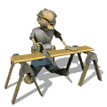
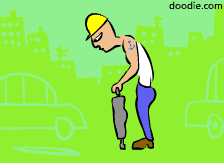
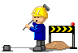

 

📍 Anywhere, Anytime 🐍 (mostly) python dev; RAG &amp; LLM agents

 

<!-- LINKS -->
<table align="center">
<tr>
<td align="center"></td>
<td align="center">
<a href="https://papka.zip">

 
<strong>★ Visit My Personal Website ★</strong>
</a>
 

</td>
<td align="center"></td>
<td align="center">
<a href="https://www.youtube.com/watch?v=dQw4w9WgXcQ">
<strong>Listen to cool music</strong>
  

</a>
 
♫ now playing ♫
</td>
</tr>
</table>

<!-- DOWNLOAD CHAOS — every link is a rickroll, do NOT click ;) -->

&nbsp;

&nbsp;

  

<a href="https://www.youtube.com/watch?v=dQw4w9WgXcQ">⬇️ DOWNLOAD NOW — 100% FREE</a> &nbsp;◆&nbsp;
<a href="https://www.youtube.com/watch?v=dQw4w9WgXcQ">🔥 setup_installer_v3.exe</a> &nbsp;◆&nbsp;
<a href="https://www.youtube.com/watch?v=dQw4w9WgXcQ">CLICK HERE !!!</a>
 
<a href="https://www.youtube.com/watch?v=dQw4w9WgXcQ">▶️ FREE DOWNLOAD (no virus)</a> &nbsp;◆&nbsp;
<a href="https://www.youtube.com/watch?v=dQw4w9WgXcQ">💾 Mirror&nbsp;#1</a> &nbsp;◆&nbsp;
<a href="https://www.youtube.com/watch?v=dQw4w9WgXcQ">💾 Mirror&nbsp;#2</a> &nbsp;◆&nbsp;
<a href="https://www.youtube.com/watch?v=dQw4w9WgXcQ">💾 Mirror&nbsp;#3</a>
 
<a href="https://www.youtube.com/watch?v=dQw4w9WgXcQ">⭐ NEW!! Premium Crack</a> &nbsp;◆&nbsp;
<a href="https://www.youtube.com/watch?v=dQw4w9WgXcQ">🎁 You are visitor 1,000,000 — CLAIM PRIZE</a> &nbsp;◆&nbsp;
<a href="https://www.youtube.com/watch?v=dQw4w9WgXcQ">🚀 Speed Up Your PC NOW</a>
 
<a href="https://www.youtube.com/watch?v=dQw4w9WgXcQ">✅ Verified Safe Download</a> &nbsp;◆&nbsp;
<a href="https://www.youtube.com/watch?v=dQw4w9WgXcQ">🆓 Free RAM (download more)</a> &nbsp;◆&nbsp;
<a href="https://www.youtube.com/watch?v=dQw4w9WgXcQ">💿 Get RealPlayer</a>
 
<a href="https://www.youtube.com/watch?v=dQw4w9WgXcQ">🐱 More Kitten GIFs (12,481 files)</a> &nbsp;◆&nbsp;
<a href="https://www.youtube.com/watch?v=dQw4w9WgXcQ">⬇ Download MP3 (320kbps)</a> &nbsp;◆&nbsp;
<a href="https://www.youtube.com/watch?v=dQw4w9WgXcQ">💥 ONE WEIRD TRICK</a> &nbsp;◆&nbsp;
<a href="https://www.youtube.com/watch?v=dQw4w9WgXcQ">🔒 Secure Download</a>

 
<em>(psst — the real site is the kitten ☝️)</em>

 

<!-- STATS -->

 

<!-- VISITOR COUNT -->

 

<!-- 88x31 BUTTON WALL -->

  

