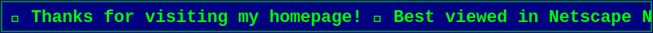

<!-- ┌─────────────────────────────────────────────────────────────┐ -->
<!-- │  idutvuk's homepage — best viewed in Netscape Navigator 4.0  │ -->
<!-- └─────────────────────────────────────────────────────────────┘ -->

<!-- HERO -->

📍 Moscow, Russia &nbsp;•&nbsp; 🐍 (mostly) python dev &nbsp;•&nbsp; 🤖 RAG &amp; LLM agents

 

<!-- SOCIAL TABLE -->
<table width="100%" align="center">
<tr>
<td align="center" width="50%">
<a href="https://papka.zip">
<strong>Visit my personal website</strong>
  

  

</a>
</td>
<td align="center" width="50%">
<a href="https://www.youtube.com/watch?v=dQw4w9WgXcQ">
<strong>Listen to cool music</strong>
   

  
♫ now playing: a timeless classic ♫
</a>
</td>
</tr>
</table>

 

<!-- CONTACT BADGES -->

 

<!-- STATS -->

 

<!-- TECH -->

 

<!-- FOOTER -->

  

  

 

© 1998–2026 idutvuk &nbsp;•&nbsp; this page is under eternal construction

